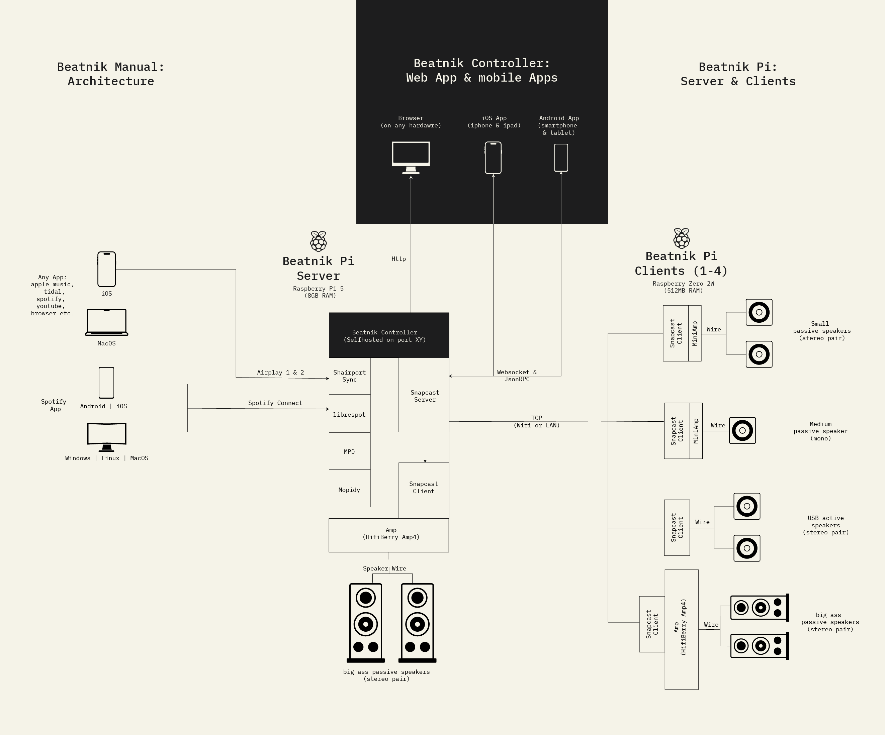

# beatnik-pi

Turn a **Raspberry Pi** into a Snapcast server that accepts **AirPlay** streams (from iOS/macOS) and re‑distributes them to any Snapclients you add later. The server itself also runs the first Snapclient, giving you an instant **master room**.

The Hardware if have choosen here is to power some biger passive Speakers using Amp4 and some smaller passive Speakers using the miniAmp.


**NOTE**: This is a basic setup to stream music via airplay (1 & 2) and spotify connect. You ca add more streams follwing the snapcast docs here: https://github.com/badaix/snapcast

## Architecture



## Software

| Component      | Version / Role                                             |
| -------------- | ---------------------------------------------------------- |
| Snapserver     | **0.31.0**  + built‑in Snapclient                          |
| Shairport‑Sync | **4.3.x** (Debian Bookworm, AirPlay 1)                     |
| Device overlay    | **HiFiBerry Amp4 Pro** *(swap for your own overlay if needed)* |
| Web UI         | **Snapweb** – grouping, volume & status                    |

---

## Hardware 
### Beatnik Pi Server

| Part               | Notes                                                |
| ------------------ | ---------------------------------------------------- |
| **Pi 5**           | Raspberry Pi OS Lite **64‑bit Bookworm** recommended |
| **HiFiBerry Amp4 Pro** | Just Plug it on your GPIOs       |
| **Power Supply**   | Amp4 is powered via DC and the pi via GPIO            |

### Beantik Pi Client

| Part               | Notes                                                |
| ------------------ | ---------------------------------------------------- |
| **Pi Zero 2 WH**           | Raspberry Pi OS Lite **64‑bit Bookworm** recommended |
| **HifiBerry Mini Amp** | Just Plug it on your GPIOs       |
| **Power Supply**   | Amp is powered via  GPIO            |

---


## 1 · Flash OS & SSH into the Pi

1. **Download** [Raspberry Pi Imager](https://www.raspberrypi.com/software/).
2. Select **Raspberry Pi OS Lite (64‑bit, Bookworm)**.
3. In *OS customisation*:

   * **Enable SSH** and add your credentials (eg. user: beatnik, pw: changeMe)
   * **Hostname:** `beatnik-server`
   * *(Optional)* enter Wi‑Fi credentials if you plan using Wi-Fi
4. Flash the card, insert it, boot up the Pi.

### SSh into the pi 

```bash
ssh beatnik@beatnik-server.local
sudo apt update && sudo apt full-upgrade -y
```

---

## 2 · Activate Drivers (HIFI Berry Amp 4 example)

Based on hifi berry docs: https://www.hifiberry.com/docs/software/configuring-linux-3-18-x/

```bash
sudo nano /boot/firmware/config.txt
```


**Remove** the line: 
```
dtparam=audio=on
```

Add **instead**:

```ini
dtoverlay=hifiberry-amp4pro
```
Scorll down and find this line:

```
dtoverlay=vc4-kms-v3d
```

add "noaudio" and makesure it looks exactly like this:

```
dtoverlay=vc4-kms-v3d,noaudio
```


Reboot, 

```
sudo rebbot
```
SSH back in,then verify:

```bash
aplay -l   # must list "sndrpihifiberry"
```


---

## 3 · Install Snapcast 0.31

```bash
cd /tmp
wget https://github.com/badaix/snapcast/releases/download/v0.31.0/\
snapserver_0.31.0-1_arm64_bookworm.deb \
snapclient_0.31.0-1_arm64_bookworm.deb

sudo apt install ./snapserver_* ./snapclient_* -y
```

---
## 4 Install Steams (at least 1)

### 4.1 · Install Shairport‑Sync (AirPlay)

```bash
sudo apt install shairport-sync -y   # v4.3.x
```

> **Keep its systemd service disabled** – Snapserver will spawn its own instance.

---

### 4.2 . librespot using raspotify (Spotify Connect - expermintal)
I had some issues with installing librespot on debian boowkworm.
To install libresport withouht issues we will workaround using raspotify & afteerwards disable it. 

Install it like discribed here: https://github.com/dtcooper/raspotify

Installation script
```bash
sudo apt-get -y install curl && curl -sL https://dtcooper.github.io/raspotify/install.sh | sh
```

Disable raspotify


```bash
sudo systemctl disable raspotify
sudo systemctl stop raspotify
```


## 5 · Configure Snapserver

```bash
sudo nano /etc/snapserver.conf
```
In the strream section add your streams as follows:
### 5.1 Airplay 1 (uses port 5000)
More details here: https://github.com/badaix/snapcast/blob/develop/doc/configuration.md#airplay
```ini
[stream]
source = airplay:///usr/bin/shairport-sync?name=AirPlay&devicename=Beatnik-Airplay1&port=5000
```
### 5.2 Airplay 2 (uses port 7000)
More details here: https://github.com/badaix/snapcast/blob/develop/doc/configuration.md#airplay
```ini
[stream]
source = airplay:///shairport-sync?name=AirPlay2&devicename=Beatnik-Airplay2&port=7000
```

Find options for device names etc here: https://github.com/badaix/snapcast/blob/develop/doc/configuration.md

### 5.3 Spotify

```ini
[stream]
source = spotify:///librespot?name=Spotify&devicename=Beatnik-Spotify
```


---

## 6 · Point Snapclient at the AMP 

```bash
sudo usermod -aG audio snapclient   # grant ALSA access

sudo tee /etc/snapclient.conf >/dev/null <<'EOF'
[snapclient]
host         = localhost
sound_device = hw:0,0        # change if card index differs
# buffer       = 80            # optional client buffer (ms)
EOF
```

---

## 7 · Start the services

```bash
sudo systemctl enable --now snapserver snapclient
```

Live logs:

```bash
journalctl -u snapserver -f   # “… starting /usr/bin/shairport-sync …”
journalctl -u snapclient -f   # “… Connected to … hw:0,0 …”
```

---

## 8 · Snapweb UI

Open **[http://audiopi.local:1780](http://audiopi.local:1780)**

* **Streams** – should list *AirPlay*
* **Clients** – should list *audiopi* with live meters & volume

---

## 9 · AirPlay test

* **macOS / appple  music**  → **AirPlay** 
* **iPhone / iPad** → apple music → **AirPlay** 
Snapweb flips to *playing* and audio starts after ≈ 0.4 s.

---

## 10 · Add more rooms

On another Pi (e.g. Pi Zero 2 W + MiniAmp):

### 10.1 Flash & first boot

*Imager settings*

```
OS           : Raspberry Pi OS Lite (32‑bit, Bookworm)
Hostname     : pizero-mini          # must be unique
SSH          : enabled
Wi‑Fi        : your credentials
```

```bash
ssh pi@pizero-mini.local
sudo passwd pi
sudo apt update && sudo apt full-upgrade -y
```

### 10.2 Enable the MiniAmp overlay

```bash
sudo nano /boot/firmware/config.txt
# add:
dtoverlay=hifiberry-dac           # MiniAmp overlay
```

Reboot and confirm `aplay -l` shows **sndrpihifiberry**.

### 10.3 Install Snapclient 0.31

```bash
cd /tmp
wget https://github.com/badaix/snapcast/releases/download/v0.31.0/\
snapclient_0.31.0-1_armhf_bookworm.deb
sudo apt install ./snapclient_* -y
```

### 10.4 Create a dedicated config

```bash
sudo usermod -aG audio snapclient

sudo tee /etc/snapclient.conf >/dev/null <<'EOF'
[snapclient]
host         = beatnik-server.local   # hostname of beatnik server pi
sound_device = hw:0,0          # card index from `aplay -l`
buffer       = 120             # Wi‑Fi cushion (ms)
EOF
```

### 10.5 Enable & start

```bash
sudo systemctl enable --now snapclient
journalctl -u snapclient -f   # look for “Connected to beatnik-server.local:1704 …”
```

### 10.6 Join the group

1. Open **Snapweb → Clients** on the main Pi.
2. Drag **pizero-mini** onto the default group tile.
3. Adjust its volume slider — it plays in sync immediately.

> Repeat for as many extra Pis as you like. Just give each one a **unique hostname** and point `host = beatnik-server.local` (or your server’s IP) in `/etc/snapclient.conf`.

---

Happy listening! 🎶

## Commands cheat sheet


