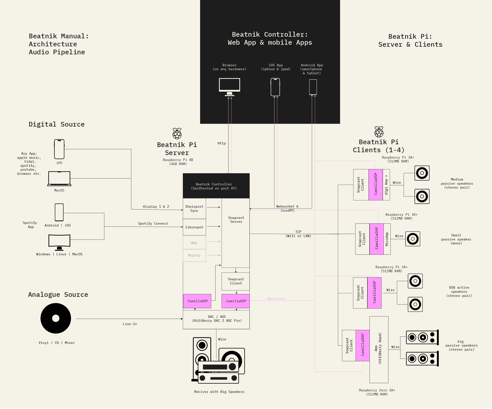
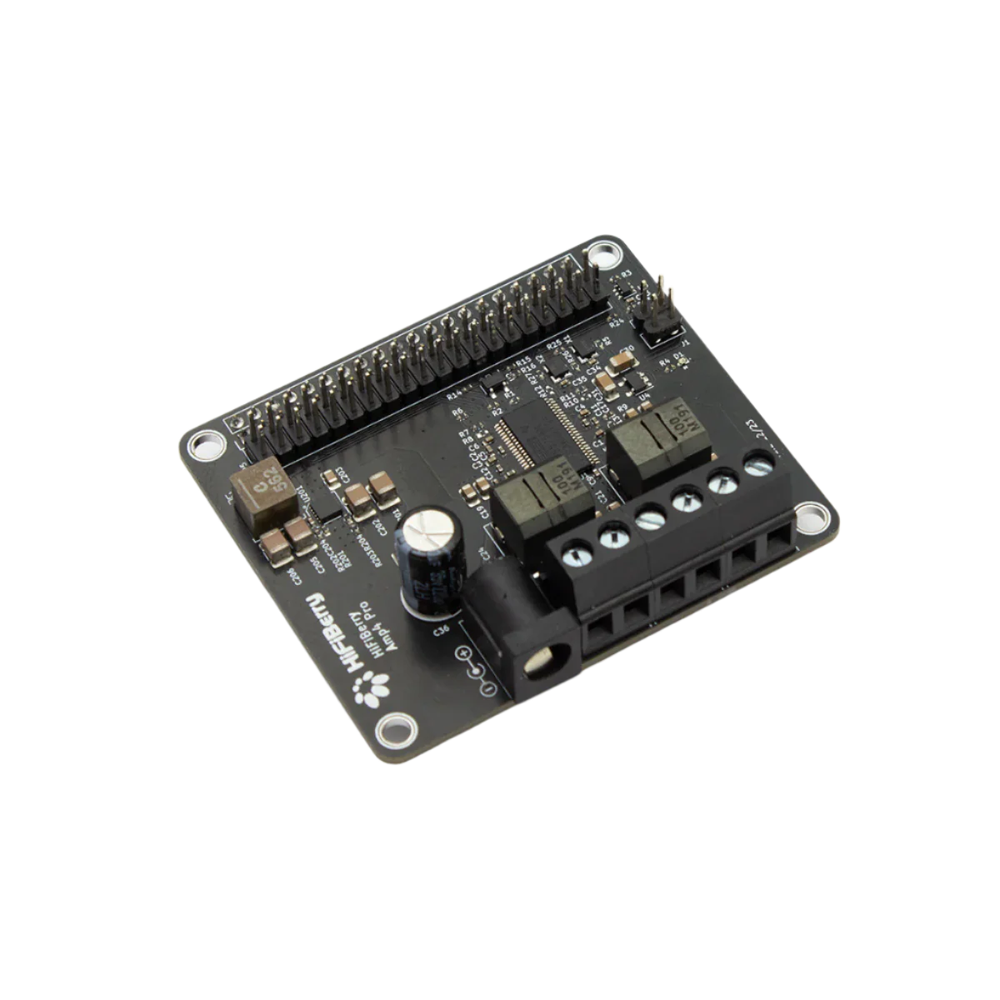

# beatnik-pi

Turn a **Raspberry Pi** into a Snapcast server that accepts **AirPlay** & **Spotify Connect** streams (from any smartphone and Laptop / PC) and re‑distributes them to any Snapclients you add later. The server itself also runs the first Snapclient, giving you an instant **master room**.

The Hardware I have choosen here is to power some biger passive Speakers using Amp4 and some smaller passive Speakers using the miniAmp.


**NOTE**: This is a basic setup to stream music via airplay (1 & 2) and spotify connect. You ca add more streams follwing the snapcast docs here: https://github.com/badaix/snapcast

## Architecture



## Software Components

| Component      | Version / Role                                             |
| -------------- | ---------------------------------------------------------- |
| Raspberry Pi OS Lite/Debian     | **Bookworm** /  operating system                          |
| Snapserver     | **0.31.0** / recives and distributes streams                          |
| Snapclient     | **0.31.0** / recives and plays streams                          |
| Shairport‑Sync | **4.3.x**  / handles airplay 1+2                |
| Libresport | **x.x**  / handles spotify connect              |
| Device overlay    | **HiFiBerry Amp4 Pro** / hardware driver *(swap for your own overlay if needed)* |
| Beatnik Controller         | **0.5.0** /Web UI & App – grouping, volume & status                    |
| Docker        | **x.x** –Containerize & host controller                   |
| CamillaDSP  | **x.x** / Digital Signal Processig / Equalizing / Room Correction

---

## Hardware Example

**Memory Crisis**
(Updated: 04.04.2026)
As we all get to enjoy a RAM / Memory shortrage due to the AI Bubble, a Silly Economy and Investor Greed (if you NVIDIA Stocks in your ETF your part of the problem). Here's the min RAM requirements: [**Computing & Hardware Requirements**](hardware-requirements.md).

### Beatnik Pi Server


| Part               | Notes                                                | Image |
| ------------------ | ---------------------------------------------------- | ----- |
| **Pi 4 (4GB RAM)**           | Raspberry Pi OS Lite **64‑bit Bookworm** recommended |  |
| **HiFiBerry Amp4 Pro** | Just Plug it on your GPIOs       |  |
| **Power Supply**   | Amp4 is powered via DC and the pi via GPIO            |       |
| **3d Printed Custom Case**   | Currently working on cases, check   [our subbredit r/beatnikAudio](https://www.reddit.com/r/beatnikAudio/) to see the progress.         |       |
| **Micro SD Card (32GB)** |  The one Raspbery pi foundation is  a good choice


NOTE: It's 2026 an we have RAM Shortage. Server can run on a Pi 3A+ (512MB RAM) but it's not recommended. A 3B+ (1GB) is already a better choice and you should be save for  with 2GB RAM, Sweetspot is Pi 4B 4GB RAM. Everything over 8GB is overkill and only usefull if you want to run other stuff on it too.

### Beantik Pi Client


| Part               | Notes                                                |
| ------------------ | ---------------------------------------------------- |
| **Pi 3A+**           | Raspberry Pi OS Lite **64‑bit Bookworm** recommended |
| **Raspberry Pi Digia Amp+** | Just Plug it on your GPIOs       |
| **Power Supply**   | Amp is powered via  GPIO            |
| **3d Printed Custom Case**   | Currently working on cases, check   [our subbredit r/beatnikAudio](https://www.reddit.com/r/beatnikAudio/) to see the progress.         |
| **Micro SD Card (32GB)** |  The one Raspbery pi foundation is  a good choice

---

NOTE: Clients do not need a lot of RAM or GHz. You can run it on a Zero 2 but we prefer the 3A+


## Installation
The easiest way to get Beatnik Running is to flash BeatnikOS using the Raspberry Pi Imager and configure your pi (eg. soundcard) using the App. For more  control there's a shell installation script and if you want full control you can use the bare metal installation below.

### A) BeatnikOS

To Flash BeatnikOS using the Raspberry PI Imager follow the guide here:

#### Beatnik Cotroller App:
**iOS**: https://apps.apple.com/ch/app/beatnik-audio/id6748608916

**Anroid**: https://play.google.com/store/apps/details?id=ch.byrds.beatnik


### B) Shell Script 
To install Beatnik using Shell script follow the shell installation guide here:


### C) Bare Metal Installation
Install everything from scratch if you want full control. Find the installation steps below:

### 1 · Flash OS & SSH into the Pi

1. **Download** [Raspberry Pi Imager](https://www.raspberrypi.com/software/).
2. Select **Raspberry Pi OS Lite (64‑bit, Bookworm)**.
3. In *OS customisation*:

   * **Enable SSH** and add your credentials (eg. user: beatnik, pw: changeMe)
   * **Hostname:** `beatnik-server`
   * *(Optional)* enter Wi‑Fi credentials if you plan using Wi-Fi
4. Flash the card, insert it, boot up the Pi.

#### SSh into the pi 

```bash
ssh beatnik@beatnik-server.local
sudo apt update && sudo apt full-upgrade -y
```

---

### 2 · Activate Drivers (HIFI Berry Amp 4 example)

**NOTE:** If you're using a diffent soundcard (DAC/amp) check the [soundcard folder in the docs](./docs/soundcards)

Based on hifi berry docs: https://www.hifiberry.com/docs/software/configuring-linux-3-18-x/

```bash
sudo nano /boot/firmware/config.txt
```


**Remove** the line: 
```
dtparam=audio=on
```

Add **instead**:

```ini
dtoverlay=hifiberry-amp4pro
```
Scorll down and find this line:

```
dtoverlay=vc4-kms-v3d
```

add "noaudio" and makesure it looks exactly like this:

```
dtoverlay=vc4-kms-v3d,noaudio
```


Reboot, 

```
sudo reboot
```
SSH back in,then verify:

```bash
aplay -l   # must list "sndrpihifiberry"
```


---

### 3 · Install Snapcast 0.31

```bash
cd /tmp
wget https://github.com/badaix/snapcast/releases/download/v0.31.0/snapserver_0.31.0-1_arm64_bookworm.deb   https://github.com/badaix/snapcast/releases/download/v0.31.0/snapclient_0.31.0-1_arm64_bookworm.deb


sudo apt install ./snapserver_* ./snapclient_* -y
```

---
### 4 Install Steams (at least 1)

#### 4.1 · Install Shairport‑Sync (AirPlay)

```bash
sudo apt install shairport-sync -y   # v4.3.x
```

> **Keep its systemd service disabled** – Snapserver will spawn its own instance.

```bash
sudo systemctl disable shairport-sync.service
```

---

#### 4.2 . librespot using raspotify (Spotify Connect - expermintal)
I had some issues with installing librespot on debian boowkworm.
To install libresport withouht issues we will workaround using raspotify & afteerwards disable it. 


Run the installation script:
```bash
sudo apt-get -y install curl && curl -sL https://dtcooper.github.io/raspotify/install.sh | sh
```

Disable raspotify: (snapcast will spawn its own instance)


```bash
sudo systemctl disable raspotify
sudo systemctl stop raspotify
```


### 5 · Configure Snapserver

```bash
sudo nano /etc/snapserver.conf
```
In the strream section add your streams as follows:
(if you have trouble setting up your streams consult the sample snapserver.conf in this repo docs/sample-configs/sample-snapserver.conf)

#### 5.1 Airplay 1 (uses port 5000)
More details here: https://github.com/badaix/snapcast/blob/develop/doc/configuration.md#airplay
```ini
[stream]
source = airplay:///usr/bin/shairport-sync?name=AirPlay&devicename=Beatnik-Airplay1&port=5000
```
#### 5.2 Airplay 2 (uses port 7000)
More details here: https://github.com/badaix/snapcast/blob/develop/doc/configuration.md#airplay
```ini
[stream]
source = airplay:///shairport-sync?name=AirPlay2&devicename=Beatnik-Airplay2&port=7000
```

Find options for device names etc here: https://github.com/badaix/snapcast/blob/develop/doc/configuration.md

#### 5.3 Spotify

```ini
[stream]
source = spotify:///librespot?name=Spotify&devicename=Beatnik-Spotify
```


---

### 6 · Point Snapclient at the AMP 

```bash
sudo usermod -aG audio snapclient   # grant ALSA access

sudo tee /etc/snapclient.conf >/dev/null <<'EOF'
[snapclient]
host         = localhost
sound_device = hw:0,0        # change if card index differs
# buffer       = 80            # optional client buffer (ms)
EOF
```

#### 6.1 (OPTIONAL) Check your card number and add it to the conf. 
Check for your soundcard number:
```bash
 aplay -l 
```

Should list your soundcard like this:
```ini
**** List of PLAYBACK Hardware Devices ****
card 0: vc4hdmi [vc4-hdmi], device 0: MAI PCM i2s-hifi-0 [MAI PCM i2s-hifi-0]
  Subdevices: 1/1
  Subdevice #0: subdevice #0
card 1: DigiAMP [RPi DigiAMP+], device 0: Raspberry Pi DigiAMP+ HiFi pcm512x-hifi-0 [Raspberry Pi DigiAMP+ HiFi pcm512x-hifi-0]
  Subdevices: 1/1
  Subdevice #0: subdevice #0

```

In this example our soundcard is in slot 1 and we want to use that. So we change the snapclient config file:

```bash
sudo nano /etc/snapclient.conf
```

Change the line here:
```bash
sound_device = hw:0,0        # change if card index differs
```
Like this:
```bash
sound_device = hw:1,0        
```


---

### 7 · Start the services

```bash
sudo systemctl enable --now snapserver snapclient
```

Reboot the pi:

```bash
sudo reboot
```

Check live logs:

```bash
journalctl -u snapserver -f 
journalctl -u snapclient -f   # “… Connected to … hw:0,0 …”

```

---

### 8 · Beatnik Controller UI (selhosted)
For more information check the controller repo here: https://github.com/byrdsandbytes/beatnik-controller

### Prequesites
Docker & docker compose. If you have trouble setting up docker compose check our guide: [DOCKER_INSTALLATION.md](https://github.com/byrdsandbytes/beatnik-controller/docs/DOCKER_INSTALLATION.md)


#### 8.1 Install using docker compose

Clone the repo:

```bash
git clone https://github.com/byrdsandbytes/beatnik-controller.git
cd beatnik-controller
```

```bash
docker compose up -d
```

This will build the Docker image and start the application in the background.

#### 8.2 Access the Application

Open your web browser and navigate to `http://localhost`, `http://beatnik-server.local`  or `http://your-hostname.local`. You should now see the Beatnik Controller interface.
  


#### 8.4 (Optional find the classic snapwebclient UI here)

Open **[http://beatnik-server.local:1780](http://beatnik-server.local:1780)**

* **Streams** – should list *AirPlay*
* **Clients** – should list *audiopi* with live meters & volume

---

### 9 · AirPlay test

* **macOS / appple  music**  → **AirPlay** 
* **iPhone / iPad** → apple music → **AirPlay** 
Snapweb flips to *playing* and audio starts after ≈ 0.4 s.

---

### 10 · Add more rooms

On another Pi (e.g. Pi Zero 2 W + MiniAmp):

#### 10.1 Flash & first boot

*Imager settings*

```
OS           : Raspberry Pi OS Lite (32‑bit, Bookworm)
Hostname     : pizero-mini          # must be unique
SSH          : enabled
Wi‑Fi        : your credentials
```

```bash
ssh pi@pizero-mini.local
sudo passwd pi
sudo apt update && sudo apt full-upgrade -y
```

(Depending on your RAM this could take a while)

#### 10.2 Enable the MiniAmp overlay

```bash
sudo nano /boot/firmware/config.txt
# add:
dtoverlay=hifiberry-dac           # MiniAmp overlay
```

Reboot and confirm `aplay -l` shows **sndrpihifiberry**.

#### 10.3 Install Snapclient 0.31

```bash
cd /tmp
wget https://github.com/badaix/snapcast/releases/download/v0.31.0/snapclient_0.31.0-1_arm64_bookworm.deb
sudo apt install ./snapclient_* -y
```

#### 10.4 Create a snapclient config

```bash
sudo usermod -aG audio snapclient

sudo tee /etc/snapclient.conf >/dev/null <<'EOF'
[snapclient]
host         = beatnik-server.local   # hostname of beatnik server pi
sound_device = hw:0,0          # card index from `aplay -l`
buffer       = 120             # Wi‑Fi cushion (ms)
EOF
```

#### 10.5 Enable & start the client

```bash
sudo systemctl enable --now snapclient
journalctl -u snapclient -f   # look for “Connected to beatnik-server.local:1704 …”
```

> Repeat for as many extra Pis as you like. Just give each one a **unique hostname** and point `host = beatnik-server.local` (or your server’s IP) in `/etc/snapclient.conf`.

---

Happy listening! 🎶

## Commands cheat sheet


