# beatnik-pi

Turn a **Raspberry Pi** into a Snapcast server that accepts **AirPlay** & **Spotify Connect** streams (from any smartphone and Laptop / PC) and re‑distributes them to any Snapclients you add later. The server itself also runs the first Snapclient, giving you an instant **master room**.

The Hardware if have choosen here is to power some biger passive Speakers directly using Amp4 pro and some smaller passive Speakers using the Amp2.

**NOTE**: This is a basic setup to stream music via airplay (1 & 2) and spotify connect. You ca add more streams follwing the snapcast docs here: https://github.com/badaix/snapcast

## Overview

- [Architecture](#architecture)
- [Software Components](#software-components)
- [Hardware Examples](#hardware-examples)
  - [Beatnik Server (Amp Pro)](#beatnik-server-amp-pro)
  - [Beatnik Client (Amp Light)](#beatnik-client-amp-light)
- [Software Installation](#software-installation)
- [Usage](#usage)
  - [iOS & Android App](#ios--android-app)
  - [Selfhosted WebApp](#selfhosted-webapp)
- [Acknowledgments & Tech Stack](#acknowledgments--tech-stack)

## Architecture
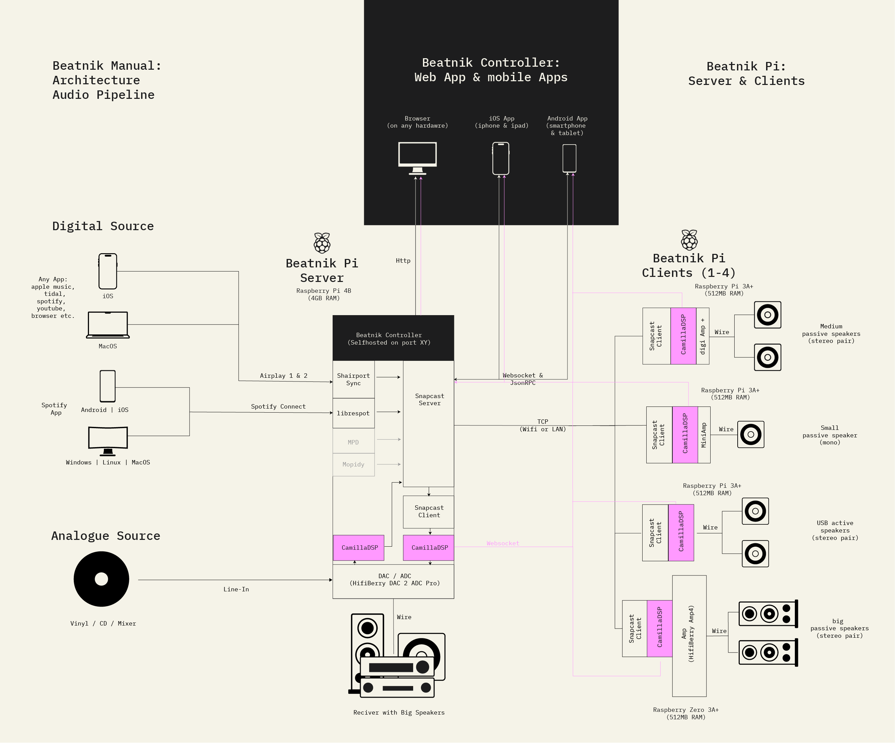

## Software Components

| Component      | Version / Role                                             |
| -------------- | ---------------------------------------------------------- |
| Raspberry Pi OS Lite/Debian | **Bookworm** / operating system |
| Snapserver     | **0.31.0** / receives and distributes streams |
| Snapclient     | **0.31.0** / receives and plays streams |
| Shairport‑Sync | **4.3.x** / handles AirPlay 1+2 |
| Librespot      | **x.x** / handles Spotify Connect |
| Device overlay | **HiFiBerry Amp4 Pro** / hardware driver *(swap for your own overlay if needed)* |
| CamillaDSP     | **2.0.3** / audio processing, EQ & room correction |
| Beatnik Hardware API | **x.x** / soundcard management & hardware control, works together with CamillaDSP |
| Beatnik Controller | **0.2.1** / Web UI & App – grouping, volume & status |
| Beatnik Bleno  | **x.x** / Bluetooth Low Energy (BLE) for headless setup / wifi provisioning |
| Docker         | **x.x** – Containerize & host controller |

---

## Hardware Examples
### Beatnik Server (Amp Pro)

| Part               | Notes                                                | Image |
| ------------------ | ---------------------------------------------------- | ----- |
| **Pi 4B**           | 2GB recommended but 1GB will work for most server usecases | 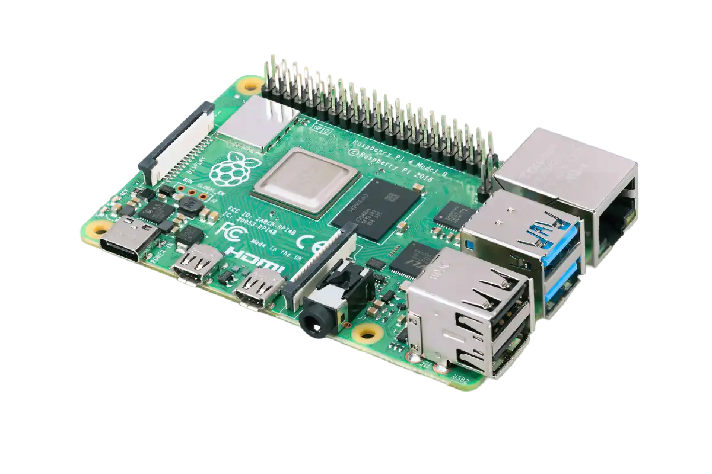 |
| **HiFiBerry Amp4 Pro** | Just Plug it on your GPIOs       | 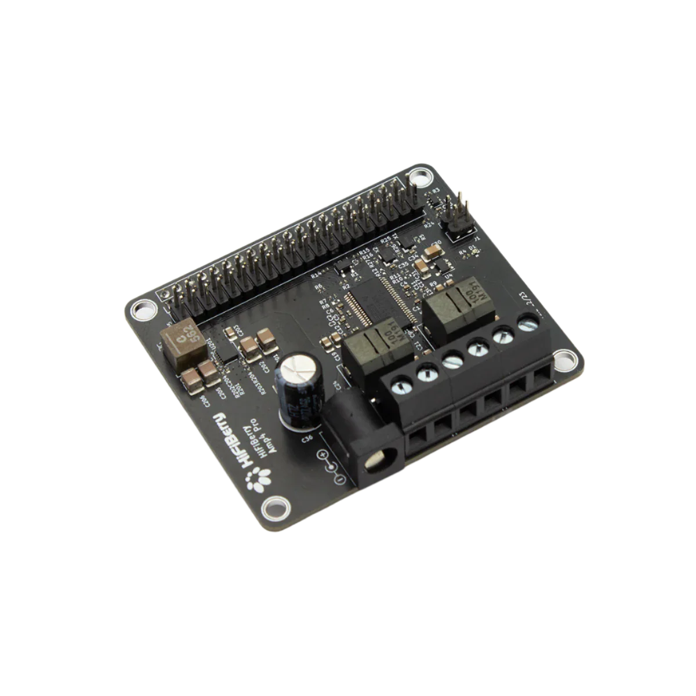 |
| **Micro SD Card** | High Quality/Endurance Recommended. Stores the operating system and software  |  |
| **Beatnik Unibody Case** *(optional)*  | Currently working on case, check   [our subbredit r/beatnikAudio](https://www.reddit.com/r/beatnikAudio/) to see the progress. | 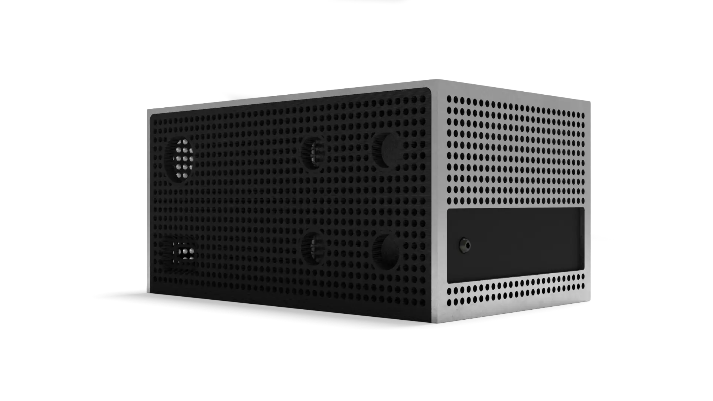 |
| **Beatnik RGB Button** *(optional)* | Connects via GPIO, used for state indication, restart, reset and wifi provisioning | 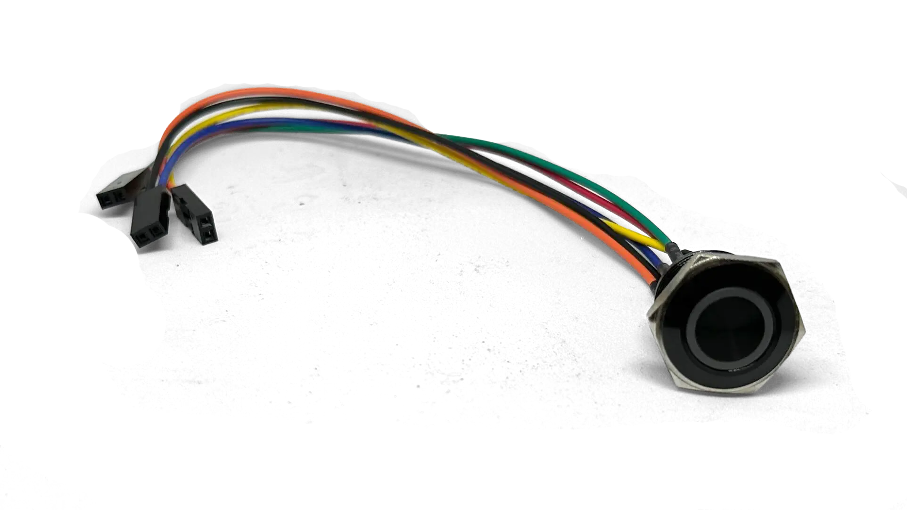 |
| **Adafruit USB-C PD Board** *(optional)* | Provides 18V power delivery for the Amp & Pi and connected peripherals |  |
| **65 W USB-C Power Supply** *(optional)*   | Amp4 is powered via PD Board and the pi via GPIO            |       |
| **Binding Posts** *(optional)* | Provides connection points for external speakers |  |
| **Gpio Spacer, Screws & PCB Stands** *(optional)* | Provides physical support and spacing for better heat management |  |

### Beatnik Client (Amp Light)

| Part               | Notes                                                |
| ------------------ | ---------------------------------------------------- |
| **Pi 3B**           | 1GB recommended but 512MB will work for most client usecases |
| **HifiBerry Amp 2** | Just Plug it on your GPIOs       |
| **Power Supply**   | Amp is powered via  GPIO            |
| **3d Printed Custom Case**   | Currently working on cases, check   [our subbredit r/beatnikAudio](https://www.reddit.com/r/beatnikAudio/) to see the progress.         |
---

## Software Installation

### Overview
There are 3 different paths to install the software:

| 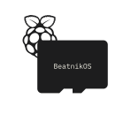 | 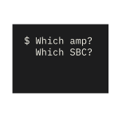 | 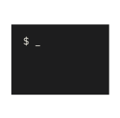 |
| :---: | :---: | :---: |
| **BeatnikOS** | **Shell Script** | **Bare Metal / Manual Installation** |
| Pre-configured OS image with all necessary drivers and software for Beatnik Server and Client | Script to automate the installation of necessary software for Beatnik Server and Client | Step-by-step guide to manually install and configure the software for Beatnik Server and Client |
| Difficulty: Easy | Difficulty: Medium | Difficulty: Hard |
[BeatnikOS Installation Guide](docs/installation-beatnik-os.md) | [Shell Script Installation Guide](docs/installation-shell-script.md) | [Bare Metal Installation Guide](docs/installation-manual-bare-metal.md)

## Usage
The Beatnik Controller app is available for both iOS and Android devices, as well as selfhosted WebApp. It allows you to setup, configure, and control your Beatnik audio system, including grouping speakers, adjusting volume, EQ settings, and checking the status of your devices.

### iOS  & Android App
- **iOS:** [Download from the App Store](https://www.google.com/url?sa=t&source=web&rct=j&opi=89978449&url=https://apps.apple.com/ch/app/beatnik-audio/)
- **Android:** [Download from Google Play](https://play.google.com/store/apps/details?id=ch.byrds.beatnik)
- **Source Code:** [GitHub Repository](https://github.com/byrdsandbytes/beatnik-controller)

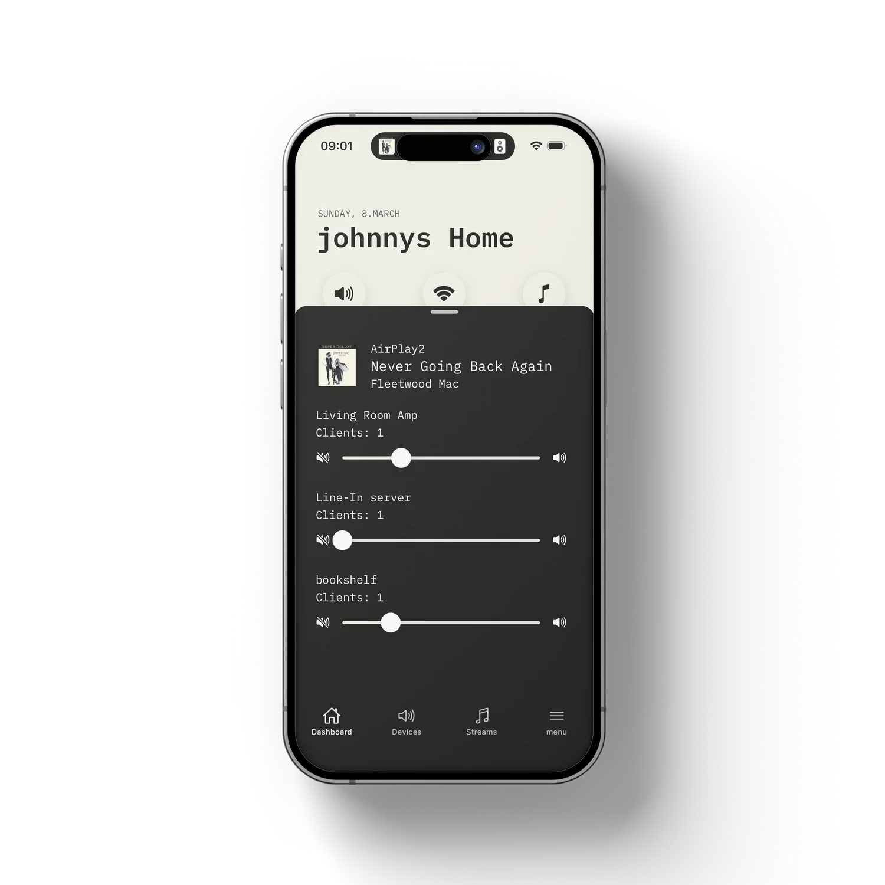
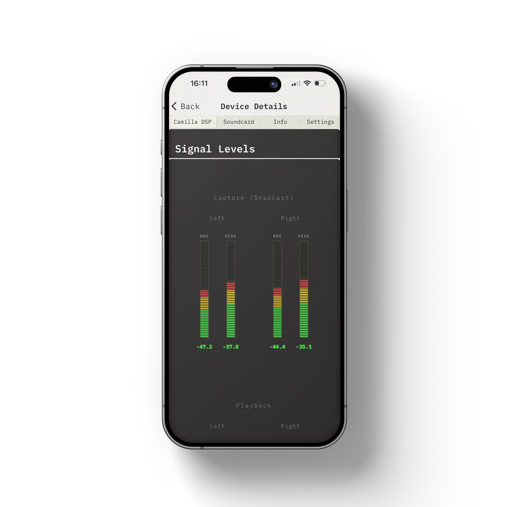

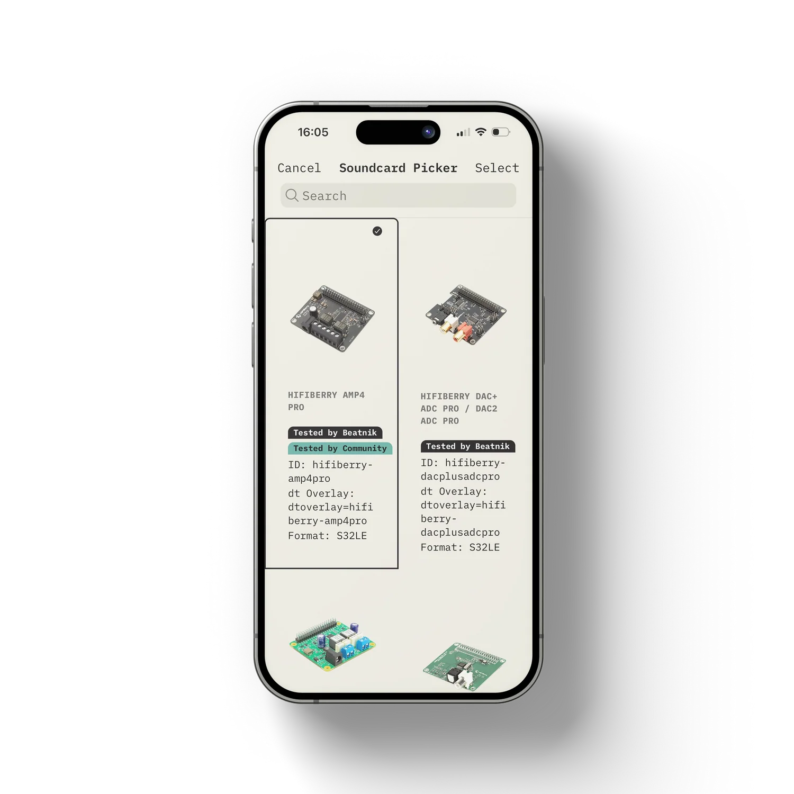

### Selfhosted WebApp

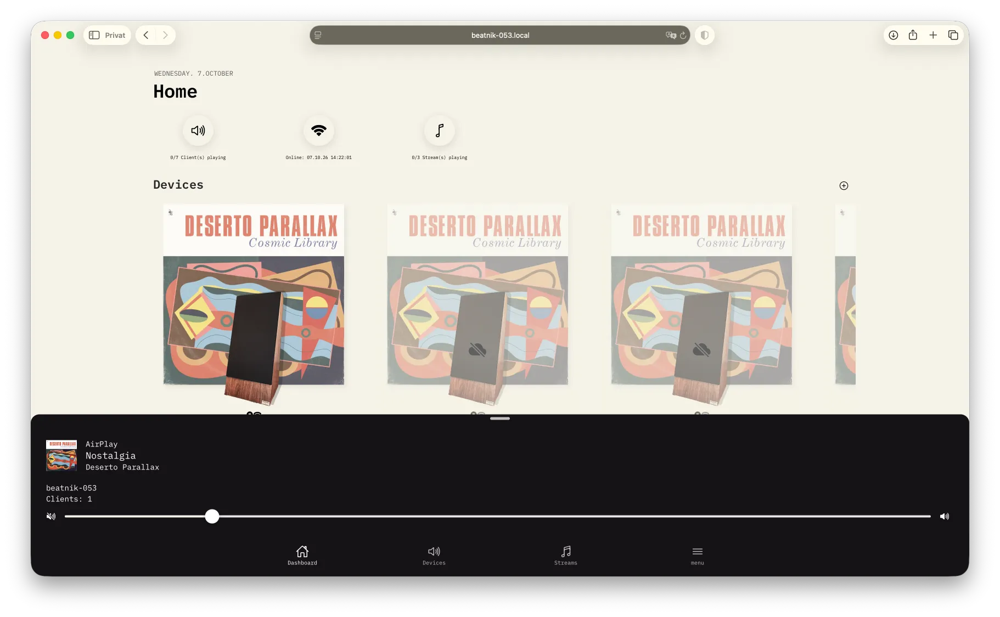
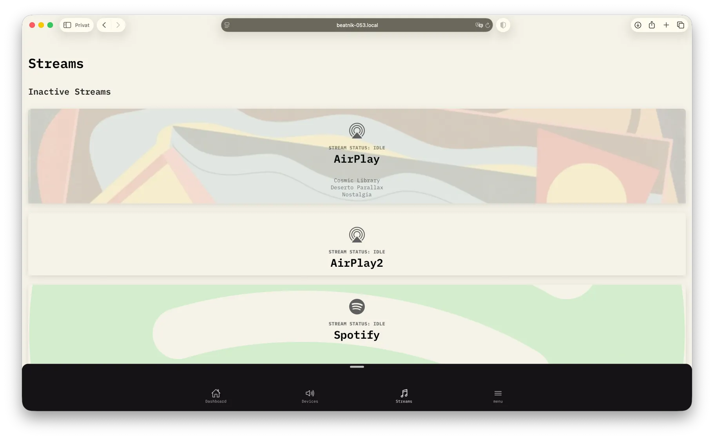
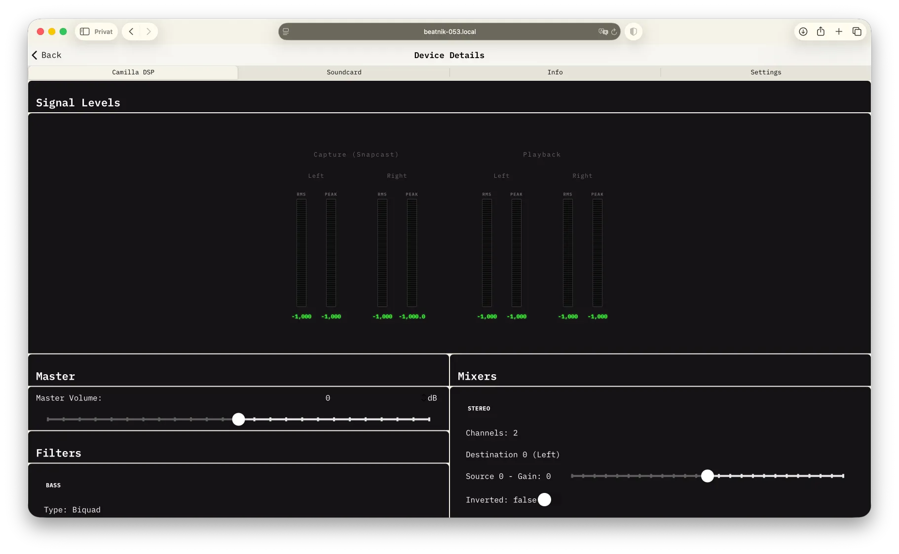

The Beatnik Controller Web UI allows you to manage your Beatnik audio system from any web browser. You can group speakers, adjust volume, configure EQ settings, and monitor the status of your devices.

Your beatnik server spawns a web interface (using docker) that you can access through your browser to manage and control your audio system without needing to use the mobile app.

- **Access:** Open a web browser and navigate to the IP address or hostname of your Beatnik server.
eg. `http://192.168.1.100` or `http://beatnik-042.local/`

Make sure your browser is on the same network as your Beatnik server and has network access to your local network.

## Acknowledgments & Tech Stack

This project utilizes the following open-source software and hardware projects:

* **[Snapcast](https://github.com/badaix/snapcast)** for synchronous multi-room audio distribution.
* **[Shairport Sync](https://github.com/mikebrady/shairport-sync)** for AirPlay 1 & 2 receiver support.
* **[librespot](https://github.com/librespot-org/librespot)** & **[Raspotify](https://github.com/dtcooper/raspotify)** for Spotify Connect integration.
* **[Mopidy](https://mopidy.com/)** & **[MPD](https://www.musicpd.org/)** for extensible music server capabilities.
* **[CamillaDSP](https://github.com/HEnquist/camilladsp)** for audio processing and equalization.
* **[HiFiBerry](https://www.hifiberry.com/)** for audio hardware (DACs, Amps) and Linux overlay support.
* **[ALSA](https://www.alsa-project.org/)** for the core Linux audio framework.
* **[Raspberry Pi](https://www.raspberrypi.com/)** & **[Raspberry Pi Imager](https://www.raspberrypi.com/software/)** for hardware infrastructure and OS flashing.
* **[Docker](https://www.docker.com/)** for containerization.
* **[Caddy](https://caddyserver.com/)** for web server and reverse proxy capabilities.
* **[Raspberry Pi OS Lite](https://www.raspberrypi.com/software/operating-systems/)**, **[Debian](https://www.debian.org/)** & **[Linux](https://www.kernel.org/)** for the underlying operating system environment.

A special thanks to the countless community members, bloggers, and forum contributors who have written tutorials and guides explaining these technologies. This project wouldn't exist without that shared knowledge.

Thank you for making Beatnik possible.

---
Have a nice Sunday. 🎈

